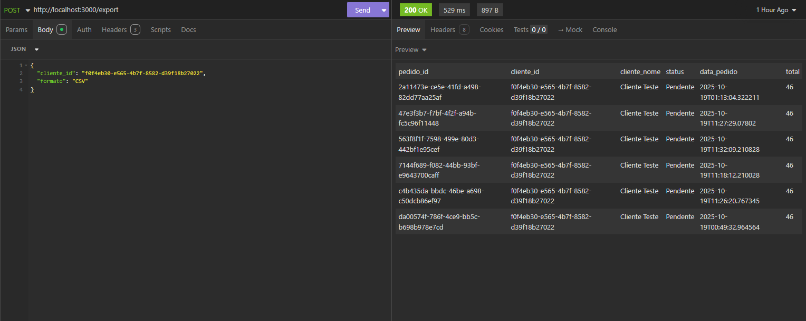
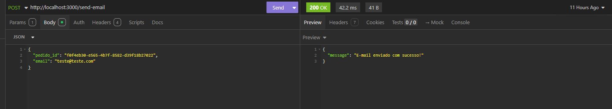

## Projeto E-commerce Node.js + Supabase


## Descrição
Este projeto é um exemplo de e-commerce desenvolvido com Node.js, TypeScript e Supabase. Ele abrange o gerenciamento de clientes, produtos, pedidos e itens de pedidos, implementando Row-Level Security (RLS) para garantir que apenas usuários autenticados possam acessar e modificar seus próprios dados.

## Funcionalidades

-Gerenciamento de Clientes: Criação, leitura, atualização e exclusão de informações de clientes.

-Gerenciamento de Produtos: Cadastro e listagem de produtos disponíveis para venda.

-Pedidos e Itens de Pedido: Criação de pedidos e associação de itens a esses pedidos.

-Cálculo Automático do Total do Pedido: Utilização de uma função RPC (calcular_total_pedido) para calcular o valor total do pedido com base nos itens associados.

-Notificações de Novos Pedidos: Envio de notificações por e-mail para informar sobre novos pedidos realizados.

-Segurança Reforçada com RLS: Implementação de políticas de segurança no banco de dados para garantir que cada usuário só tenha acesso aos seus próprios dados.

## Tecnologias Utilizadas

-Node.js: Ambiente de execução JavaScript no servidor.

-TypeScript: Superset do JavaScript que adiciona tipagem estática, melhorando a qualidade e manutenção do código.

-Supabase: Plataforma de backend como serviço que fornece banco de dados PostgreSQL, autenticação e APIs em tempo real.

-Express.js: Framework para construção de APIs RESTful.

-Dotenv: Carregamento de variáveis de ambiente a partir de um arquivo .env.

## Decisões de Arquitetura

-Uso de TypeScript: A escolha do TypeScript visa proporcionar tipagem estática, o que reduz erros em tempo de execução e facilita a refatoração e manutenção do código.

-Supabase como Backend: Optou-se pelo Supabase devido à sua integração nativa com PostgreSQL, suporte a autenticação e funcionalidades de segurança como RLS, simplificando o desenvolvimento e aumentando a segurança da aplicação.

-Express.js para APIs: O Express.js foi escolhido por sua simplicidade e flexibilidade na construção de APIs RESTful, permitindo um desenvolvimento ágil e organizado.

-Segurança com Row-Level Security (RLS)

-Tabelas Protegidas: As tabelas clientes, produtos, pedidos e itens_pedido possuem RLS habilitado.

-Políticas de Segurança: Foram criadas políticas FOR INSERT e FOR SELECT que restringem o acesso aos dados com base no owner_id, garantindo que cada usuário só possa acessar e modificar seus próprios dados.

-Uso de auth.uid(): A função auth.uid() é utilizada para obter o ID do usuário autenticado, assegurando que as políticas de RLS sejam aplicadas corretamente.

## Lógica de Implementação
-Criação de Pedidos: Ao criar um pedido, os itens associados são inseridos na tabela itens_pedido. Em seguida, é chamada a função RPC calcular_total_pedido para calcular o valor total do pedido com base nos itens inseridos.

-Notificações por E-mail: Um endpoint dedicado envia notificações por e-mail para informar sobre novos pedidos. Este endpoint pode ser integrado a serviços de envio de e-mails como SendGrid ou Amazon SES.

-Uso de Índices: Índices foram criados nas colunas owner_id para otimizar as consultas que utilizam RLS e melhorar a performance geral da aplicação.


**Clone o repositório:**
   ```bash
   git clone https://github.com/brunokemel/Teste-T-cnico-Escribo.git
   cd Teste-T-cnico-Escribo
   ```

   **Instale as dependencias:**
   ```bash
    npm install
   ```

   **Configure as Variáveis de Ambiente:**(Crie um arquivo .env na raiz do projeto com as seguintes variáveis:)
   ```bash
    SUPABASE_URL=<sua-url>
    SUPABASE_SERVICE_ROLE_KEY=<sua-service-role-key>
   ```

   **Inicialize os Dados de Teste:**
   ```bash
    npx ts-node src/index.ts
   ```

## Row-Level Security (RLS)
-Tabelas Protegidas: As tabelas clientes, produtos, pedidos e itens_pedido possuem RLS habilitado.

-Políticas Criadas: Foram criadas políticas FOR INSERT e FOR SELECT que restringem o acesso aos dados com base no owner_id, garantindo que cada usuário só possa acessar e modificar seus próprios dados.

-Scripts Idempotentes: Os scripts para criação das políticas são idempotentes, utilizando DROP POLICY IF EXISTS para evitar erros em execuções subsequentes.

-Índices para Performance: Recomenda-se a criação de índices na coluna owner_id para melhorar a performance das consultas que utilizam RLS.

-Rollback: Para desabilitar o RLS, utilize os comandos DROP POLICY e ALTER TABLE ... DISABLE ROW LEVEL SECURITY.

## Testes feitos com _insomnia_
### Exportar Pedidos


### Enviar E-mail



## Conclusão
O projeto demonstra a implementação de um e-commerce utilizando tecnologias modernas e práticas recomendadas de segurança e arquitetura. Usando as tecnologias pedidas na descrição do teste com **_uso de tabelas, Row-Level Security(RLS), funções no banco de dados, Criação de views e Edge Functions_**